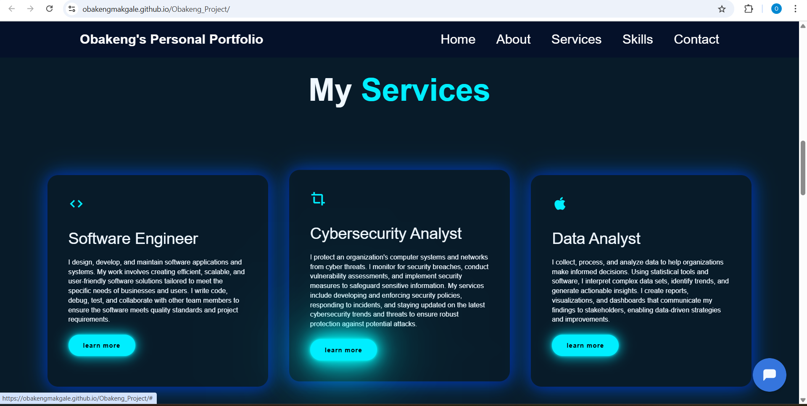

# Obakeng_Project

Obakeng's Personal Portfolio
Welcome to my personal portfolio website! This site showcases my skills, services, and projects as a Full Stack Developer.
It provides information about me, my background, academic achievements and many more.
The website also incorporates a chatbot to provide quick information to users. 
The chatbot is a "plug and play" chatbot configured using Botpress.

# Table of Contents:

1. Description

2. Features

3. Technologies Used

4. Installation

5. Usage

6. Contact

# Description:

This website serves as my personal portfolio to highlight my professional background, technical skills, services, and projects. It reflects my expertise in software development, UI/UX design, and business systems. Through this portfolio, you can learn more about my work, my journey, and how to get in touch with me for collaboration.

# Features:

Home Section: Introduction with a brief personal bio.

About Section: Detailed description of my background, education, and professional experience.

Skills Section: Visual representation of my technical and professional skills.

Portfolio Section: A showcase of my recent projects.

Services Section: Information on the services I offer.

Contact Section: A form for visitors to send me messages and links to my social media profiles.

# Technologies Used:

HTML5: Markup language for structuring the content.

CSS3: Styling the layout and visual aspects of the site.

JavaScript: Adds interactivity to the website.

Boxicons: Icon library used for social media links and skill representations.

Typed.js: JavaScript library for creating dynamic typing effects.

Botpress: The website also incorporates a chatbot to provide quick information to users.

# Installation:

To run this project locally, follow these steps:

Clone the repository:

bash
Copy
Edit
git clone https://github.com/username/obakeng-portfolio.git
Navigate to the project folder:

bash
Copy
Edit
cd obakeng-portfolio
Open index.html in your preferred browser.

# Usage:

Once you open the website, you can navigate through different sections using the navigation bar. The following sections are available:

Home: Introduction and links to social media.

About: Details about my background and expertise.

Skills: Visual display of my technical and professional skills.

Portfolio: Some of my latest projects.

Services: Overview of services offered.

Contact: Contact form for inquiries and collaborations.

# Contact:

If you'd like to collaborate or have any questions, feel free to reach out!

Email: obakengmakgale13@gmail.com

Phone: 071*******

LinkedIn: https://www.linkedin.com/in/obakeng-makgale-578085271/  

Website: https://obakengmakgale.github.io/Obakeng_Project/

